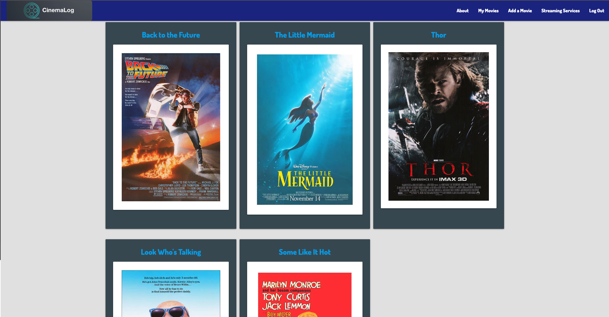

# CinemaLog

CinemaLog is a full CRUD movie managment application that uses authentication and authorization to store and handle information about your favorite films using Django, Postgres, and AWS.

---

## Screenshots

---

## Technologies Used
Python3
Django
Materialize
Postgres
HTML5
CSS
AWS
Heroku

---

## Getting Started

[Click Here](https://cinemalog-ar-83.herokuapp.com/) to see deployed Heroku app.

[Click Here](https://trello.com/b/8UkeObB7/cinemalog) to view Trello Board.

---

## Future Enhancements

Add a third party API like OMDB, the ablilty to rate and review, profiles, and the ability to visit and view other user's profiles.